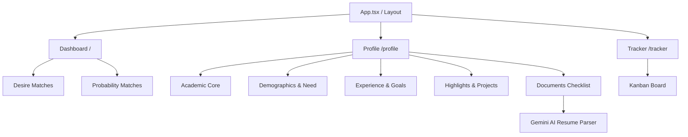

# Scholarship Hunter

An AI-powered scholarship discovery, matching, and tracking platform built on top of the Orbix Health Dashboard architecture.

## What We Are Doing
We are transforming a robust dashboard base into a personalized AI assistant. The system uses a Python (FastAPI) backend for scraping and LLM logic, paired with a Vite (React) frontend. 

Crucially, the UI/UX development is guided by a specific suite of AI agent personas to ensure a premium, non-generic aesthetic.

## Architecture Map


## Directory Scaffold
For AI agents navigating the codebase, here is the master directory layout:

```text
Scholarship-hunter/
├── backend/                  # FastAPI Backend (Python)
│   ├── database.py           # DB Config
│   ├── models.py             # SQLAlchemy Models (Profile, ProfileDocument, Scholarship, etc.)
│   ├── schemas.py            # Pydantic Schemas
│   ├── uploads/              # Local uploaded files (CVs, Recommendations, Diplomas)
│   ├── main.py               # API Endpoints (Upload, Parse, Scan, Draft, etc.)
│   └── ai_agent.py           # LangChain + Gemini LLM integration for scoring, parsing, drafting
├── docs/
│   └── agents/               # AI Persona Rules (Taste, Impeccable, Memanto, etc.)
├── frontend/                 # Vite + React (Orbix Base)
│   ├── src/
│   │   ├── components/       # Reusable UI components
│   │   │   ├── dashboard/    # Header, Sidebar, MetricCards
│   │   │   └── layout/       # App Layout wrapper
│   │   ├── pages/            # React Router Views (Dashboard, Profile, Tracker)
│   │   ├── index.css         # Tailwind & Theme Variables (Dark Mode included)
│   │   └── App.tsx           # Router Configuration
│   └── package.json          # Frontend Dependencies
├── .memanto/                 # Project memory ledger
├── AGENTS.md                 # Master orchestration instructions for AI
└── README.md                 # This file
```

## Profile & Documents Feature (New)
The Profile section features a premium **Interactive Overview Landing Dashboard**:
- **Profile Strength Gauge**: Dynamically calculates setup completeness (0% to 100%) based on filled inputs and documents.
- **Interactive Progress Stepper**: Displays a clickable stepper line with dots and checks (Academic Core, Experience & Goals, Personal Highlights, Documents Checklist). Clicking any step navigates directly to that section.
- **AI Quick Start Cards**: Includes CTA cards for CV/Resume and Bachelor's Diploma. Uploading a CV here uploads the file and automatically triggers the Gemini AI parser, completing the fields in a single step.

The Profile details can also be managed manually across four subcategories:
1. **Academic Core**: Full name, major, GPA, and demographic traits.
2. **Experience & Goals**: Text summaries of professional roles, long-term career aspirations, and financial need statements.
3. **Personal & Highlights**: Volunteer details, personal hobbies/interests, key projects, awards/honors, languages, and publications.
4. **Documents Checklist**: Tracks and accepts uploads for:
   - **CV / Resume** (Supports PDF, TXT, DOCX)
   - **Recommendation Letters (1, 2, 3)**
   - **Bachelor's Diploma / Transcript**

### Gemini-Powered AI Autofill
When a user uploads their CV/Resume, they can click the **AI Extract** button. The backend extracts text from the document (using `pypdf`) and prompts Gemini (`gemini-1.5-flash`) to parse all details. The database profile is automatically populated, and the UI values update instantly.

These profile categories are passed to the AI drafting agent to compile rich, context-aware scholarship essays.

### E2E Testing & Performance Tuning
To ensure maximum UI responsiveness and prevent regressions:
- **Playwright E2E Suite**: Tests Profile Manager tab transitions, stepper node redirects, and captures visual screenshots under `frontend/e2e-screenshots/`.
- **Latency Optimization**: Configured the frontend and tests to query the backend via explicit IPv4 loopback (`127.0.0.1`) instead of `localhost`. This bypassed IPv6 resolution timeouts, reducing page load latency from ~7.5 seconds to **sub-100ms** (75ms).

To run the E2E tests:
```bash
cd frontend
npm run test:e2e
```

## Progress & TODOs

### Already Done
- [x] Initial FastAPI backend setup with Database models (Profile, Scholarship).
- [x] Cloned and integrated the Orbix Health Dashboard base as the new Vite/React frontend.
- [x] Installed and orchestrated visual AI skills (`impeccable`, `huashu-design`, `ui-ux-pro-max`, `taste`).
- [x] Installed frontend dependencies and configured React Router.
- [x] Migrated the custom Scholarship UI (Desire vs Probability matches, Kanban Tracker) into the Orbix layout.
- [x] Added Dark Mode toggle and horizontal scrolling to the Kanban tracker.
- [x] Setup Memanto memory logging.
- [x] Created advanced profile subsections (hobbies, volunteer, projects, experience, awards, publications, goals, financial need).
- [x] Created `ProfileDocument` table & logic to handle CV, recommendations, and diploma uploads.
- [x] Added PDF text extractor (`pypdf`) and python-multipart server dependencies.
- [x] Created Gemini-powered structured extraction endpoint to parse CVs and auto-populate user profiles.
- [x] Integrated all extended profile fields into the AI essay drafting context.
- [x] Redesigned the Profile manager with tabs, upload cards, status badges, and autofill actions.
- [x] Installed Playwright and created performance & visual E2E tests.
- [x] Resolved IPv6 DNS loopback resolution lag to bring page load speeds down to sub-100ms.

### TODOs
- [ ] Build the Python web scraper to feed the `scholarships` table.
- [ ] Connect the remaining frontend UI components to the FastAPI backend endpoints (Dashboard and Tracker).

