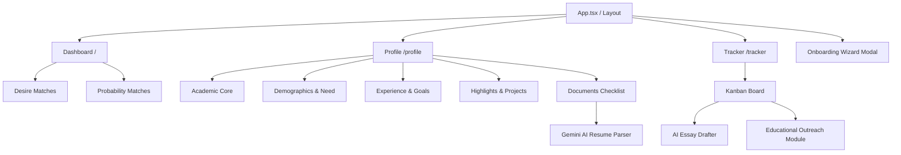

# Educational Pathfinder (formerly Scholarship Hunter)

An AI-powered academic program discovery, financial aid matching, and career migration platform built on the Orbix Dashboard architecture.

## What We Are Doing
We have pivoted the project from a simple "Scholarship Hunter" into a holistic **Educational Pathfinder**. The platform now embraces "Brain-Circulation", supports local, hybrid, and online study alternatives (not just emigration), and acts as a reality check for adult learners by calculating Relocation Feasibility scores based on their CVs.

The system uses a Python (FastAPI) backend for scraping and LLM logic, paired with a Vite (React) frontend. 

Crucially, the UI/UX development is guided by a specific suite of AI agent personas to ensure a premium, non-generic aesthetic.

## Architecture Map


## Directory Scaffold
For AI agents navigating the codebase, here is the master directory layout:

```text
Scholarship-hunter/
├── backend/                  # FastAPI Backend (Python)
│   ├── database.py           # DB Config
│   ├── discovery_logs/       # Detailed JSON execution logs & token/cost metrics for each scan
│   ├── models.py             # SQLAlchemy Models (Profile, ProfileDocument, Scholarship, etc.)
│   ├── schemas.py            # Pydantic Schemas
│   ├── uploads/              # Local uploaded files (CVs, Recommendations, Diplomas)
│   ├── main.py               # API Endpoints (Upload, Parse, Scan, Draft, etc.)
│   └── ai_agent.py           # LangChain + Gemini LLM integration for scoring, parsing, drafting
├── docs/
│   ├── agents/                   # AI Persona Rules (Taste, Impeccable, Memanto, etc.)
│   ├── database_schema.md        # Data Dictionary and Entity Relationship Diagram
│   ├── token_cost_analysis.md    # Cost projections for Gemini AI token usage
│   ├── gemini_scaling_strategy.md # Operational constraints and roadmap to scale Gemini API to production
│   └── research_foundation.md    # Academic research justifying the Educational Pathfinder pivot
├── frontend/                 # Vite + React (Orbix Base)
│   ├── src/
│   │   ├── components/       # Reusable UI components
│   │   │   ├── dashboard/    # Header, Sidebar, MetricCards
│   │   │   └── layout/       # App Layout wrapper
│   │   ├── pages/            # React Router Views (Dashboard, Profile, Tracker)
│   │   ├── index.css         # Tailwind & Theme Variables (Dark Mode included)
│   │   └── App.tsx           # Router Configuration
│   └── package.json          # Frontend Dependencies
├── .memanto/                 # Project memory ledger
├── AGENTS.md                 # Master orchestration instructions for AI
└── README.md                 # This file
```

## How to Run the Project (Unified Developer Menu)

We provide a cross-platform Developer Menu automation system at the root level of the project. This system handles directory traversal, Python virtual environment activation, log merging, and automatic process tree termination when exiting.

### Quick Start (Recommended)
You can run the interactive developer menu using either `npm` (cross-platform, requires Node.js) or `make` (Unix, macOS, or Windows with Git Bash/WSL).

#### Option A: Using NPM (Cross-Platform)
From the root of the project, run:
```bash
npm start
```
or
```bash
npm run dev
```

#### Option B: Using Make (Unix / Git Bash / WSL)
If you have `make` installed on your system, run:
```bash
make
```
or
```bash
make menu
```

This will launch the interactive **Scholarship Hunter Developer Menu**:
```text
==================================================
       ★  SCHOLARSHIP HUNTER DEVELOPER MENU  ★    
==================================================
  [1] Run Full Project (Frontend + Backend Concurrently)
  [2] Run FastAPI Backend Only
  [3] Run React Frontend Only
  [4] Run Playwright E2E Tests
  [5] Seed Database with Mock Programs & Applications
  [6] Unseed Database
  [7] Exit
==================================================
```

### Direct CLI Shortcuts
You can also bypass the menu and execute targets directly from your shell at the root level:

| Task / Feature | Command | Description |
|---|---|---|
| **Run Full Project** | `node menu.js --run-all` | Runs Vite and FastAPI concurrently, merging and color-coding output logs in one terminal. |
| **Run Backend Only** | `node menu.js --run-backend` | Starts FastAPI on port 8000 using the python virtual environment. |
| **Run Frontend Only** | `node menu.js --run-frontend` | Starts Vite development server on port 5173. |
| **Run E2E Tests** | `node menu.js --run-tests` | Runs the Playwright E2E test suite. |
| **Seed Database** | `node menu.js --seed` | Clears and seeds database tables with mock academic programs and scholarship applications. |
| **Unseed Database** | `node menu.js --unseed` | Clears all mock academic programs and scholarships from the database. |
| **Clean Database** | `node menu.js --clean` | Deletes all programs and scholarships that have an 'Unknown' provider or institution due to incomplete extraction. |

> [!TIP]
> **Process Cleanup**: When you terminate the runner (using `Ctrl+C` or exiting the menu), the utility automatically kills the entire spawned process tree (including uvicorn and node). This prevents orphaned processes from locking up ports `8000` or `5173` on Windows and Unix systems.

---

### Manual / Separate Run Instructions (Legacy)
If you prefer running the servers manually in separate terminal windows:

> [!IMPORTANT]
> **Python Version Requirement**: While the main FastAPI backend can run on Python 3.14, some dependencies in the workspace (such as `crewai` in `external_repos/memanto/examples/crewai-memory/requirements.txt`) do not yet support Python 3.14. It is **highly recommended to use Python 3.12** for the Python environment in this workspace to avoid installation failures.

#### 1. Running the Backend (FastAPI)
The backend requires Python and uvicorn to serve the API.

1. **Open a terminal** and navigate to the backend directory:
   ```bash
   cd backend
   ```
2. **Activate the virtual environment**:
   - On Windows (PowerShell):
     ```powershell
     .\venv\Scripts\activate
     ```
   - On Windows (Command Prompt):
     ```cmd
     .\venv\Scripts\activate.bat
     ```
   - On macOS/Linux:
     ```bash
     source venv/bin/activate
     ```
3. **Install Dependencies**:
   ```bash
   pip install -r requirements.txt
   ```
4. **Configure Environment**:
   Ensure you have a `.env` file in the `backend` directory containing your API keys (e.g., `GEMINI_API_KEY`). You can also configure crawler limits to control execution speed and prevent runaway token consumption:
   - `SEARCH_MAX_RESULTS`: Max seed URLs returned from DuckDuckGo per query (default: 5).
   - `SCRAPER_DEPTH_LIMIT`: Scrapy link traversal depth (default: 1. Set to 0 to only scan seed URLs without following sublinks).
   - `SCRAPER_MAX_PAGES`: Hard ceiling on the total number of crawled pages per scan (default: 8) to prevent endless crawling loops.
   - `SCRAPER_MAX_TEXT_LENGTH`: Maximum characters per page sent to the LLM to protect token usage (default: 5000).
5. **Start the Server**:
   ```bash
   uvicorn main:app --reload --host 127.0.0.1 --port 8000
   ```
   The backend API will run at `http://127.0.0.1:8000`.

#### 2. Running the Frontend (Vite + React)
The frontend uses Vite for fast development builds.

1. **Open a new terminal** and navigate to the frontend directory:
   ```bash
   cd frontend
   ```
2. **Install node packages**:
   ```bash
   npm install
   ```
3. **Start the development server**:
   ```bash
   npm run dev
   ```
   The frontend will run at `http://localhost:5173` (or check terminal output for the specific port).

> [!IMPORTANT]
> **HeroUI Version & Tailwind CSS Compatibility**:
> The project utilizes **Tailwind CSS v3** (`3.4.17`) and **React 18**. To maintain compatibility with this environment, the project uses **HeroUI v2** (`@heroui/react` version `^2.8.10`) rather than HeroUI v3 (which requires Tailwind CSS v4 and React 19+).
> 
> In `tailwind.config.ts`, the theme content scanning path must point to `./node_modules/@heroui/theme/dist/**/*.{js,ts,jsx,tsx}` instead of `@heroui/react/dist` to avoid PostCSS transform resolution errors.

---

## 1. Profile Manager & Dashboard Safeguards
Rather than forcing users through a fragmented wizard, all first-time onboarding is consolidated directly into the **Profile Manager**. 

### Preferences & Goals Tab
The Profile Manager features a dedicated "Preferences & Goals" tab that captures:
1. **Delivery Modality**: Online, Hybrid, In-Person (Local), or In-Person (Abroad).
2. **Primary Goals**: Local Growth, Entrepreneurship, Emigrate, or Brain-Circulation.
3. **Interactive Target Locations Dashboard**: A premium, full-width 3D Globe map (Carto GL/MapLibre) integrated with a filter/search sidebar. Allows users to click countries on the globe or toggle continents/countries directly in the sidebar to classify them as Desired (Pros), Avoided (Cons), or Neutral. Displays real-time statistics (counts for desired, avoided, and target continents) and summaries. **Country-level preferences take priority over continent defaults**, enabling users to target a continent as desired (e.g., Europe) while explicitly avoiding specific countries (e.g., Russia and Belarus) as exceptions. The interface visually highlights explicit overrides.
4. **Interests & Tags**: Keywords (e.g., Sustainability, AI, Business) to align the AI scraping process.

### Dashboard Safelocks & Reality Checks
To ensure the Discovery Engine generates high-quality matches, the Dashboard acts as a strict gatekeeper:
- **Locked Overlay**: If a user's profile lacks critical data (e.g., Modality or Geographic Targets), the "Program Matches" and "Financial Aid" lanes are visually obscured behind a frosted glass layer.
- **CTA Modal**: Clicking the disabled "Run Discovery Scan" button triggers a modal with a direct CTA to complete the Profile.
- **Relocation Feasibility Score**: For users targeting programs abroad, the AI analyzes their CV (looking for language proficiency and multinational experience) and displays a Feasibility Score (0-100%). This provides a realistic "visa check" (represented by Shield or Warning icons) directly on the Program Match cards.

### Frontend Error Resilience & Real-Time Progress Safeguards
To prevent frontend crashes and keep the user informed during long scanning processes:
- **Real-Time Scan Progress Bar**: Replaced the synchronous, blocking scan endpoint with a Server-Sent Events (SSE) `StreamingResponse` inside [main.py](file:///c:/Users/migue/.gemini/antigravity/scratch/Scholarship-hunter/backend/main.py#L166). The frontend reads the stream chunk-by-chunk and renders a premium, glowing progress bar showing the exact execution phase (e.g. searching, crawling, analyzing, saving) and percentage completion (0-100%). This keeps the HTTP connection alive, prevents browser request timeouts, and provides immediate visual feedback.
- **Custom Error Boundary**: A premium, glassmorphic class-component `ErrorBoundary` (located in [ErrorBoundary.tsx](file:///c:/Users/migue/.gemini/antigravity/scratch/Scholarship-hunter/frontend/src/components/ErrorBoundary.tsx)) is wrapped around the entire application in `App.tsx`. In the event of a runtime error (e.g. ReferenceError, TypeError, or component crash), it intercepts the failure and presents a beautiful recovery screen showing the error details, stack trace (in a styled scrollable viewport), and buttons to reload the application or go to the home route.
- **Robust API Response Checking**: In `frontend/src/lib/api.ts`, a unified `handleResponse` helper processes all fetch requests. If the backend returns a non-2xx code (e.g., a 500 server error or validation failure), it extracts the detail field and raises a descriptive `Error` that is propagated directly to React Query query and mutation callbacks (e.g. displaying error toast notifications instead of failing silently).
- **Last Scan Timestamp Indicator**: Exposes the `GET /scholarships/last-scan` endpoint to retrieve the timestamp of the latest log in `backend/discovery_logs/`. The frontend fetches this on load and refetches it when a scan successfully runs, displaying a styled glassmorphic label next to the scan button.

## 2. Profile & Documents Feature
The Profile section features a premium **Interactive Overview Landing Dashboard**:
- **Profile Strength Gauge**: Dynamically calculates setup completeness (0% to 100%) based on filled inputs and documents.
- **Interactive Progress Stepper**: Displays a clickable stepper line with dots and checks (Academic Core, Experience & Goals, Personal Highlights, Documents Checklist). Clicking any step navigates directly to that section.
- **AI Quick Start Cards**: Includes CTA cards for CV/Resume and Bachelor's Diploma. Uploading a CV here uploads the file and automatically triggers the Gemini AI parser, completing the fields in a single step.

The Profile details can also be managed manually across four subcategories:
1. **Academic Core**: Full name, major, GPA, and demographic traits.
2. **Experience & Goals**: Text summaries of professional roles, long-term career aspirations, and financial need statements.
3. **Personal & Highlights**: Volunteer details, personal hobbies/interests, key projects, awards/honors, a full-width interactive language manager (supporting CEFR & custom inputs), and publications.
4. **Documents Checklist**: Tracks and accepts uploads for:
   - **CV / Resume** (Supports PDF, TXT, DOCX)
   - **Recommendation Letters (1, 2, 3)**
   - **Bachelor's Diploma / Transcript**

### 3. Application Strategy & Outreach (Tracker)
The app uses a Kanban-style board in the Tracker page to mirror the real-life application journey: *Discovered, To Apply, Drafting, Applied, Rejected, Won*. 
From the Tracker, users can trigger AI actions:
- **AI Essay Drafter**: Generates personalized essays.
- **Educational Outreach Module**: Instead of just generating an email blindly, this module first educates the user on *why* contacting the university financial aid office is important, lists the typical steps to follow, and *then* provides an AI-generated professional inquiry email using their profile context.

### Gemini-Powered AI Autofill
When a user uploads their CV/Resume, they can click the **AI Extract** button. The backend extracts text from the document (using `pypdf`) and prompts Gemini (`gemini-3.5-flash`) to parse all details. The database profile is automatically populated, and the UI values update instantly.

- **Robust API Type Coercion**: To prevent FastAPI `ResponseValidationError` when GPA values are stored or parsed as floats/integers, the backend response schemas utilize a custom Pydantic `field_validator` (`coerce_gpa`) to dynamically cast any numeric GPAs to string formats before returning them to the client.

## Frontend UI/UX Standards

For detailed information on frontend styling, UI components, animation profiles, loading skeletons, and E2E performance testing, please refer to the dedicated [Frontend UI Standards](docs/frontend_ui_standards.md) document.

## Progress & TODOs

### Already Done
- [x] Initial FastAPI backend setup with Database models (Profile, Scholarship).
- [x] Cloned and integrated the Orbix Health Dashboard base as the new Vite/React frontend.
- [x] Installed and orchestrated visual AI skills (`impeccable`, `huashu-design`, `ui-ux-pro-max`, `taste`).
- [x] Installed frontend dependencies and configured React Router.
- [x] Migrated the custom Scholarship UI (Desire vs Probability matches, Kanban Tracker) into the Orbix layout.
- [x] Added Dark Mode toggle and horizontal scrolling to the Kanban tracker.
- [x] Setup Memanto memory logging.
- [x] Implemented automatic SQLite schema migrations in `backend/database.py` to seamlessly add new columns (e.g. Wizard Preferences, Research metrics, and modality/psychology preferences like `has_dependents`, `primary_goal`, `preferred_modality`, `relocation_feasibility_score`, and `target_diaspora_regions`) on app startup.
- [x] Created advanced profile subsections (hobbies, volunteer, projects, experience, awards, publications, goals, financial need).
- [x] Created `ProfileDocument` table & logic to handle CV, recommendations, diploma uploads, and language certifications.
- [x] Added PDF text extractor (`pypdf`) and python-multipart server dependencies.
- [x] Created Gemini-powered structured extraction endpoint to parse CVs and auto-populate user profiles, including nationalities, structured language tracking, and detailed professional experience (inferring multinational roots from companies).
- [x] Integrated all extended profile fields into the AI essay drafting context.
- [x] Redesigned the Profile manager with tabs, upload cards, status badges, autofill actions, and a comprehensive **Matching Preferences** suite.
- [x] Implemented a Continent -> Country -> Region hierarchical geoselector querying the CountriesNow API dynamically.
- [x] Built a real-time global university selector querying the Hipolabs Universities API with debounced autocomplete suggestions.
- [x] Enhanced global card layout glassmorphism (transparency, frosted blur, and border intensity) and added ambient top-right viewport glowing elements.
- [x] Overhauled the Onboarding Wizard to feature a fully interactive, high-fidelity world map using the `react-svg-worldmap` package (fully themed with custom CSS overrides for dark/light modes), dynamic country/region state loading via CountriesNow, and real-time university auto-suggestions via Hipolabs (saving structured targets directly to the profile database).
- [x] Installed Playwright and created performance & visual E2E tests.
- [x] Resolved IPv6 DNS loopback resolution lag to bring page load speeds down to sub-100ms.
- [x] Built the Onboarding Wizard UI to capture user target preferences and tags upon first visit.
- [x] Expanded the Database Models (Profile & Scholarships) to store user preferences, prestige, and benefits.
- [x] Implemented the Educational Outreach Module in the Tracker to educate users on university contact and generate inquiry emails via Gemini.
- [x] Added automatic geographic region zooming when selecting continents, manual scale controls, and click-and-drag panning on the world map to make selecting small countries easy.
- [x] Implemented sticky stacked desktop layouts for page headers, action buttons, and sidebar tabs in both Profile and Dashboard views.
- [x] Enhanced sticky layouts: reduced header background opacity from 80% to 40% for better ambient glow blending, increased Profile tabs sticky top offset to 220px to prevent overlapping, and made the main application sidebar sticky (`top-[72px] h-[calc(100vh-72px)]`) to remain fixed when scrolling.
- [x] Glitch-free Preferences State: Refactored the `PreferencesTab` state model to derive tags and locations directly from parent form props (removing the synchronization `useEffect` hooks), completely resolving the loop re-rendering flickering bug when adding or removing targets.
- [x] Extended Academic Core & Demographics suggestions: Converted cumulative GPA to a text input to accept relative class rank strings (e.g. `Top 5%`), added class rank suggestions chips (`Top 5%`, `Top 10%`, `Summa Cum Laude`, etc.), and added toggleable demographic chip selections that append or remove traits in a comma-separated format.
- [x] Relaxed AuthGuard restrictions to allow navigating to Discover and Tracker without forcing a prior resume/CV upload.
- [x] Updated the Profile Setup Health metric to Pathfinder Preparedness and capped it at 60% with an "Awaiting Preferences" status if matching criteria are incomplete, aligning it with the dashboard safeguards.
- [x] Designed ultra-premium, high-contrast, glowing gradient CTA buttons in both light/dark modes for the locked overlays and modals.
- [x] Implemented a premium, full-width 3D Globe target locations selector integrated with a filter/search sidebar showing real-time desired/avoided statistics, customized legends, and continent level quick toggles.
- [x] Refined target locations dashboard: resolved state synchronization issues, replaced boundary-clipped MapLibre native popups with a floating React card overlay, optimized vertical map space by setting the bottom continent cards panel to a compact h-10 with abbreviations (e.g., S./N. America) and no globe icons, removed separate continent metrics, narrowed the sidebar to lg:w-[250px], simplified counters/summary to track total desired/avoided countries, and implemented smart automatic globe map pan/zoom focusing on a random user-preferred country or continent on load.
- [x] Map Theme Synchronization: Resolved theme mismatch issues where the world map remained in light mode positron style regardless of the dashboard theme. Implemented a `MutationObserver` on the document root class list to reactively sync `isDarkMode` state inside the map container and disabled MapLibre style diffing (`{ diff: false }`) to cleanly swap map base stylesheets between CartoDB Positron and Dark Matter, rendering deep grey/black country fill colors (`#0a0a0c`) for neutral countries in dark mode.
- [x] Map Direct Toggles: Configured direct left-click (desired/neutral) and right-click (avoided/neutral) toggling for countries on the map. Intercepted right-click (`contextmenu`) events on the canvas to disable default browser dropdowns, wrapped callbacks in mutable React refs to prevent stale closure bugs in MapLibre event listeners, and added safeguards to alert the user if a clicked country inherits its status from a parent continent setting.
- [x] Reworked profile languages selector with a full-width, two-dropdown (language & level) Radix Select UI, displaying entries as composite 'Language / Level' chips.
- [x] Geographic Targets Prioritization & Exceptions: Overrode default continent-level target behavior to prioritize country-level preferences (desired/avoided) over continent defaults. Enabled clicking/toggling countries even when their continent is selected, and added override descriptions in the country detail popup card.
- [x] Built the Python Discovery Engine pipeline: Implemented `search_seeder` using DuckDuckGo to bypass API keys, built a robust Scrapy crawler (`scraper.py`) with depth and token-truncation limits, and configured an `ai_agent` pipeline to parse the scraped unstructured text into a strict `ExtractedScholarship` JSON schema, validating the results and pushing them to the database.
- [x] Implemented environment variable configuration (`.env`) to securely control crawler limits (max results, depth limit, text truncation) without hardcoding values in Python.
- [x] Replaced the native HTML family checkbox with a premium HeroUI `<Checkbox>` component in the Profile tab.
- [x] Configured the application to default to Dark Mode with localStorage persistence, preventing flash-of-light-theme on load.
- [x] Implemented a premium React Error Boundary and robust API HTTP status response checking to prevent silent rendering crashes and gracefully display errors to the user.
- [x] Migrated from deprecated and frozen `duckduckgo-search` package to `ddgs` in the Python backend environment, resolving empty search results during discovery runs.
- [x] Created detailed Discovery Scan execution logger inside the FastAPI backend, saving JSON logs of each query, crawl, scraped details, and token/cost calculations to the `backend/discovery_logs/` directory.
- [x] Implemented real-time Server-Sent Events (SSE) streaming scan updates on the backend, displaying a premium glowing scan progress bar with current phase messages and percentage indicators on the dashboard.
- [x] Last Scan Timestamp Indicator: Implemented backend log parsing API and a glassmorphic UI indicator with a pulsing green indicator next to the scan button, updating automatically upon scan completion.
- [x] Refactored Discovery pipeline to use `Scrapling` stealth bypass library and Hugging Face Open-Source models (Qwen2.5) to avoid Cloudflare 403 blocks and rate limits.
- [x] Rebuilt the `ai_agent` Extractor to perform Parallel Multi-Entity Extraction. The LLM now analyzes webpages and extracts both Scholarships AND Target Academic Programs (degrees, master's) simultaneously into separate lists.
- [x] Upgraded `TargetProgram` schemas and DB logic to parse actionable application steps, important deadlines, and recommended next actions, alongside personalized desire and probability scores.
- [x] Implemented Strict AI Scoring Engine: Enforced strict major-alignment rejection rules, a Hard Ceiling (max 30%) on Probability scores if missing hard requirements (tests/GPA), and a 40/30/30 weighting for Desire scores based on academics, location, and career goals.
- [x] Introduced Actionable Advice UI: The AI generates specific improvement projections telling the user exactly how to bypass the probability ceiling, rendered vividly on Dashboard cards.
- [x] Added Soft-Delete Discarding & Machine Learning Hook: Users can discard irrelevant programs from the dashboard via a new `PATCH /discard` endpoint. Items are hidden but preserved (`status = "Discarded"`) to eventually train ML ranking models.
- [x] Implemented University-Centric Dashboard UI: Programs are logically grouped under their host universities, replacing the fragmented global list.
- [x] Built Targeted Funding Engine: Added `POST /api/programs/{id}/find-funding` endpoint. Each program now has a dedicated "Find Funding" button that launches an isolated SSE scan, searching exclusively for financial aid at that specific university and rendering secured matches nested directly underneath the academic program.

### TODOs
- [x] Connect the remaining frontend UI components to the FastAPI backend endpoints (Dashboard and Tracker).
