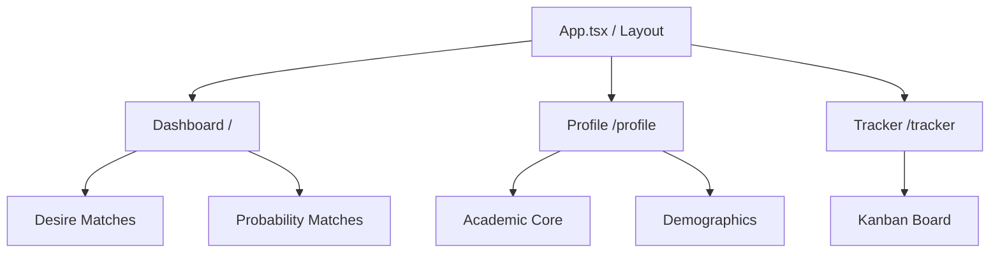

# Scholarship Hunter

An AI-powered scholarship discovery, matching, and tracking platform built on top of the Orbix Health Dashboard architecture.

## What We Are Doing
We are transforming a robust dashboard base into a personalized AI assistant. The system uses a Python (FastAPI) backend for scraping and LLM logic, paired with a Vite (React) frontend. 

Crucially, the UI/UX development is guided by a specific suite of AI agent personas to ensure a premium, non-generic aesthetic.

## Architecture Map


## Directory Scaffold
For AI agents navigating the codebase, here is the master directory layout:

```text
Scholarship-hunter/
├── backend/                  # FastAPI Backend (Python)
│   ├── database.py           # DB Config
│   ├── models.py             # SQLAlchemy Models
│   └── main.py               # API Endpoints (Pending LangChain Integration)
├── docs/
│   └── agents/               # AI Persona Rules (Taste, Impeccable, Memanto, etc.)
├── frontend/                 # Vite + React (Orbix Base)
│   ├── src/
│   │   ├── components/       # Reusable UI components
│   │   │   ├── dashboard/    # Header, Sidebar, MetricCards
│   │   │   └── layout/       # App Layout wrapper
│   │   ├── pages/            # React Router Views (Dashboard, Profile, Tracker)
│   │   ├── index.css         # Tailwind & Theme Variables (Dark Mode included)
│   │   └── App.tsx           # Router Configuration
│   └── package.json          # Frontend Dependencies
├── .memanto/                 # Project memory ledger
├── AGENTS.md                 # Master orchestration instructions for AI
└── README.md                 # This file
```

## Progress & TODOs

### Already Done
- [x] Initial FastAPI backend setup with Database models (Profile, Scholarship).
- [x] Cloned and integrated the Orbix Health Dashboard base as the new Vite/React frontend.
- [x] Installed and orchestrated visual AI skills (`impeccable`, `huashu-design`, `ui-ux-pro-max`, `taste`).
- [x] Installed frontend dependencies and configured React Router.
- [x] Migrated the custom Scholarship UI (Desire vs Probability matches, Kanban Tracker) into the Orbix layout.
- [x] Added Dark Mode toggle and horizontal scrolling to the Kanban tracker.
- [x] Setup Memanto memory logging.

### TODOs
- [ ] Build the Python web scraper to feed the `scholarships` table.
- [ ] Integrate LangChain in the backend for AI scoring and essay drafting.
- [ ] Connect the frontend UI components to the FastAPI backend endpoints.
