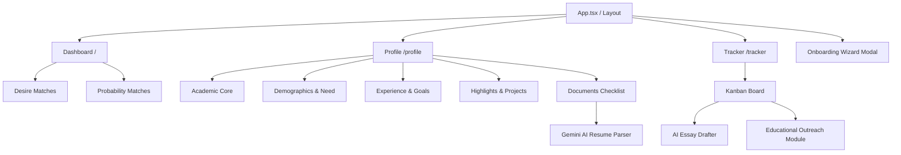

# Educational Pathfinder (formerly Scholarship Hunter)

An AI-powered academic program discovery, financial aid matching, and career migration platform built on the Orbix Dashboard architecture.

## What We Are Doing
We have pivoted the project from a simple "Scholarship Hunter" into a holistic **Educational Pathfinder**. The platform now embraces "Brain-Circulation", supports local, hybrid, and online study alternatives (not just emigration), and acts as a reality check for adult learners by calculating Relocation Feasibility scores based on their CVs.

The system uses a Python (FastAPI) backend for scraping and LLM logic, paired with a Vite (React) frontend. 

Crucially, the UI/UX development is guided by a specific suite of AI agent personas to ensure a premium, non-generic aesthetic.

## Architecture Map


## Directory Scaffold
For AI agents navigating the codebase, here is the master directory layout:

```text
Scholarship-hunter/
├── backend/                  # FastAPI Backend (Python)
│   ├── database.py           # DB Config
│   ├── models.py             # SQLAlchemy Models (Profile, ProfileDocument, Scholarship, etc.)
│   ├── schemas.py            # Pydantic Schemas
│   ├── uploads/              # Local uploaded files (CVs, Recommendations, Diplomas)
│   ├── main.py               # API Endpoints (Upload, Parse, Scan, Draft, etc.)
│   └── ai_agent.py           # LangChain + Gemini LLM integration for scoring, parsing, drafting
├── docs/
│   ├── agents/                   # AI Persona Rules (Taste, Impeccable, Memanto, etc.)
│   ├── database_schema.md        # Data Dictionary and Entity Relationship Diagram
│   ├── token_cost_analysis.md    # Cost projections for Gemini AI token usage
│   └── research_foundation.md    # Academic research justifying the Educational Pathfinder pivot
├── frontend/                 # Vite + React (Orbix Base)
│   ├── src/
│   │   ├── components/       # Reusable UI components
│   │   │   ├── dashboard/    # Header, Sidebar, MetricCards
│   │   │   └── layout/       # App Layout wrapper
│   │   ├── pages/            # React Router Views (Dashboard, Profile, Tracker)
│   │   ├── index.css         # Tailwind & Theme Variables (Dark Mode included)
│   │   └── App.tsx           # Router Configuration
│   └── package.json          # Frontend Dependencies
├── .memanto/                 # Project memory ledger
├── AGENTS.md                 # Master orchestration instructions for AI
└── README.md                 # This file
```

## How to Run the Project (Unified Developer Menu)

We provide a cross-platform Developer Menu automation system at the root level of the project. This system handles directory traversal, Python virtual environment activation, log merging, and automatic process tree termination when exiting.

### Quick Start (Recommended)
You can run the interactive developer menu using either `npm` (cross-platform, requires Node.js) or `make` (Unix, macOS, or Windows with Git Bash/WSL).

#### Option A: Using NPM (Cross-Platform)
From the root of the project, run:
```bash
npm start
```
or
```bash
npm run dev
```

#### Option B: Using Make (Unix / Git Bash / WSL)
If you have `make` installed on your system, run:
```bash
make
```
or
```bash
make menu
```

This will launch the interactive **Scholarship Hunter Developer Menu**:
```text
==================================================
       ★  SCHOLARSHIP HUNTER DEVELOPER MENU  ★    
==================================================
  [1] Run Full Project (Frontend + Backend Concurrently)
  [2] Run FastAPI Backend Only
  [3] Run React Frontend Only
  [4] Run Playwright E2E Tests
  [5] Exit
==================================================
```

### Direct CLI Shortcuts
You can also bypass the menu and execute targets directly from your shell at the root level:

| Task / Feature | NPM command | Makefile command | Description |
|---|---|---|---|
| **Run Full Project** | (Use Option 1 from `npm start`) | `make run` | Runs Vite and FastAPI concurrently, merging and color-coding output logs in one terminal. |
| **Run Backend Only** | `npm run backend` | `make run-backend` | Starts FastAPI on port 8000 using the python virtual environment. |
| **Run Frontend Only** | `npm run frontend` | `make run-frontend` | Starts Vite development server on port 5173. |
| **Run E2E Tests** | `npm run test:e2e` | `make test` | Runs the Playwright E2E test suite. |

> [!TIP]
> **Process Cleanup**: When you terminate the runner (using `Ctrl+C` or exiting the menu), the utility automatically kills the entire spawned process tree (including uvicorn and node). This prevents orphaned processes from locking up ports `8000` or `5173` on Windows and Unix systems.

---

### Manual / Separate Run Instructions (Legacy)
If you prefer running the servers manually in separate terminal windows:

> [!IMPORTANT]
> **Python Version Requirement**: While the main FastAPI backend can run on Python 3.14, some dependencies in the workspace (such as `crewai` in `external_repos/memanto/examples/crewai-memory/requirements.txt`) do not yet support Python 3.14. It is **highly recommended to use Python 3.12** for the Python environment in this workspace to avoid installation failures.

#### 1. Running the Backend (FastAPI)
The backend requires Python and uvicorn to serve the API.

1. **Open a terminal** and navigate to the backend directory:
   ```bash
   cd backend
   ```
2. **Activate the virtual environment**:
   - On Windows (PowerShell):
     ```powershell
     .\venv\Scripts\activate
     ```
   - On Windows (Command Prompt):
     ```cmd
     .\venv\Scripts\activate.bat
     ```
   - On macOS/Linux:
     ```bash
     source venv/bin/activate
     ```
3. **Install Dependencies**:
   ```bash
   pip install -r requirements.txt
   ```
4. **Configure Environment**:
   Ensure you have a `.env` file in the `backend` directory containing your API keys (e.g., `GEMINI_API_KEY`).
5. **Start the Server**:
   ```bash
   uvicorn main:app --reload --host 127.0.0.1 --port 8000
   ```
   The backend API will run at `http://127.0.0.1:8000`.

#### 2. Running the Frontend (Vite + React)
The frontend uses Vite for fast development builds.

1. **Open a new terminal** and navigate to the frontend directory:
   ```bash
   cd frontend
   ```
2. **Install node packages**:
   ```bash
   npm install
   ```
3. **Start the development server**:
   ```bash
   npm run dev
   ```
   The frontend will run at `http://localhost:5173` (or check terminal output for the specific port).

---

## 1. Profile Manager & Dashboard Safeguards
Rather than forcing users through a fragmented wizard, all first-time onboarding is consolidated directly into the **Profile Manager**. 

### Preferences & Goals Tab
The Profile Manager features a dedicated "Preferences & Goals" tab that captures:
1. **Delivery Modality**: Online, Hybrid, In-Person (Local), or In-Person (Abroad).
2. **Primary Goals**: Local Growth, Entrepreneurship, Emigrate, or Brain-Circulation.
3. **Interactive Target Countries Map**: A fully interactive SVG world map (`react-svg-worldmap`) that renders all global countries. Users can click to select the specific countries they wish to target.
4. **Interests & Tags**: Keywords (e.g., Sustainability, AI, Business) to align the AI scraping process.

### Dashboard Safelocks & Reality Checks
To ensure the Discovery Engine generates high-quality matches, the Dashboard acts as a strict gatekeeper:
- **Locked Overlay**: If a user's profile lacks critical data (e.g., Modality or Geographic Targets), the "Program Matches" and "Financial Aid" lanes are visually obscured behind a frosted glass layer.
- **CTA Modal**: Clicking the disabled "Run Discovery Scan" button triggers a modal with a direct CTA to complete the Profile.
- **Relocation Feasibility Score**: For users targeting programs abroad, the AI analyzes their CV (looking for language proficiency and multinational experience) and displays a Feasibility Score (0-100%). This provides a realistic "visa check" (represented by Shield or Warning icons) directly on the Program Match cards.

## 2. Profile & Documents Feature
The Profile section features a premium **Interactive Overview Landing Dashboard**:
- **Profile Strength Gauge**: Dynamically calculates setup completeness (0% to 100%) based on filled inputs and documents.
- **Interactive Progress Stepper**: Displays a clickable stepper line with dots and checks (Academic Core, Experience & Goals, Personal Highlights, Documents Checklist). Clicking any step navigates directly to that section.
- **AI Quick Start Cards**: Includes CTA cards for CV/Resume and Bachelor's Diploma. Uploading a CV here uploads the file and automatically triggers the Gemini AI parser, completing the fields in a single step.

The Profile details can also be managed manually across four subcategories:
1. **Academic Core**: Full name, major, GPA, and demographic traits.
2. **Experience & Goals**: Text summaries of professional roles, long-term career aspirations, and financial need statements.
3. **Personal & Highlights**: Volunteer details, personal hobbies/interests, key projects, awards/honors, languages, and publications.
4. **Documents Checklist**: Tracks and accepts uploads for:
   - **CV / Resume** (Supports PDF, TXT, DOCX)
   - **Recommendation Letters (1, 2, 3)**
   - **Bachelor's Diploma / Transcript**

### 3. Application Strategy & Outreach (Tracker)
The app uses a Kanban-style board in the Tracker page to mirror the real-life application journey: *Discovered, To Apply, Drafting, Applied, Rejected, Won*. 
From the Tracker, users can trigger AI actions:
- **AI Essay Drafter**: Generates personalized essays.
- **Educational Outreach Module**: Instead of just generating an email blindly, this module first educates the user on *why* contacting the university financial aid office is important, lists the typical steps to follow, and *then* provides an AI-generated professional inquiry email using their profile context.

### Gemini-Powered AI Autofill
When a user uploads their CV/Resume, they can click the **AI Extract** button. The backend extracts text from the document (using `pypdf`) and prompts Gemini (`gemini-3.5-flash`) to parse all details. The database profile is automatically populated, and the UI values update instantly.

- **Form Integrity Lock**: During the AI extraction process, all input fields, textareas, and save buttons are programmatically disabled to prevent conflict. On the input-centric tabs (*Academic Core*, *Experience & Goals*, and *Highlights & Projects*), a translucent glassmorphic loader overlay is displayed, visually blocking edits while keeping the inputs underneath readable. Users can freely navigate through all tabs to monitor the AI autofill progress in real-time.
- **Robust API Type Coercion**: To prevent FastAPI `ResponseValidationError` when GPA values are stored or parsed as floats/integers, the backend response schemas utilize a custom Pydantic `field_validator` (`coerce_gpa`) to dynamically cast any numeric GPAs to string formats before returning them to the client.

The wizard leverages the project's standard Radix-based `Select` component framework rather than external React UI libraries (like `@heroui/react`). This avoids dependency version conflicts with Tailwind CSS v3 and ensures seamless styling integration.

### E2E Testing & Performance Tuning
To ensure maximum UI responsiveness and prevent regressions:
- **Playwright E2E Suite**: Tests Profile Manager tab transitions, stepper node redirects, and captures visual screenshots under `frontend/e2e-screenshots/`.
- **Latency Optimization**: Configured the frontend and tests to query the backend via explicit IPv4 loopback (`127.0.0.1`) instead of `localhost`. This bypassed IPv6 resolution timeouts, reducing page load latency from ~7.5 seconds to **sub-100ms** (75ms).
- **Onboarding Wizard Bypass**: To prevent the onboarding wizard modal overlay from blocking UI interactions during test runs, the component detects automated runs via `window.navigator.webdriver` (and support for `?bypass_wizard=true` parameter), allowing Playwright tests to access and test the underlying profile tabs seamlessly.

To run the E2E tests:
```bash
cd frontend
npm run test:e2e
```

## UI Design Standard: Skeleton Loaders

For a premium, non-generic look, this project avoids full-page spinners and empty states during loading. Instead, always implement visual skeletons that mimic the exact layout of the target component to prevent layout shifts.

* **Usage**: Import the `Skeleton` primitive from `@/components/ui/skeleton`:
  ```tsx
  import { Skeleton } from "@/components/ui/skeleton";
  ```
* **Best Practices**:
  - Keep heights and widths matching or approximating the expected loaded card/content dimensions (e.g., `<Skeleton className="h-5 w-2/3" />`).
  - Use container skeletons inside layouts (e.g., sidebars, forms, card lists) to render early layout frameworks while data fetches.

## UI Design Standard: Smooth Transitions & Interactive States

To maintain a fluid, premium tactile feel, all page transitions, tab switches, and hover interactions must use smooth animation profiles:

* **Tab Switching**: Use the `.animate-tab-content` utility class on the root element of any tab page panel. This applies a `0.35s` slide-up and fade-in animation using a premium cubic-bezier ease (`cubic-bezier(0.16, 1, 0.3, 1)`).
* **Interactive Elements**: All interactive controls (`button`, `a`, `input`, `textarea`, `select`) have global transition behaviors configured in `index.css`. This ensures hover and focus states (backgrounds, borders, shadows, scales) transition smoothly over `0.25s` rather than snapping instantly.
* **Containers & Cards**: Glassmorphic card surfaces (`.bg-card`, `.card-surface`) transition background-colors, borders, box-shadows, and transforms smoothly over `0.3s` using the same custom bezier easing.

## Progress & TODOs

### Already Done
- [x] Initial FastAPI backend setup with Database models (Profile, Scholarship).
- [x] Cloned and integrated the Orbix Health Dashboard base as the new Vite/React frontend.
- [x] Installed and orchestrated visual AI skills (`impeccable`, `huashu-design`, `ui-ux-pro-max`, `taste`).
- [x] Installed frontend dependencies and configured React Router.
- [x] Migrated the custom Scholarship UI (Desire vs Probability matches, Kanban Tracker) into the Orbix layout.
- [x] Added Dark Mode toggle and horizontal scrolling to the Kanban tracker.
- [x] Setup Memanto memory logging.
- [x] Implemented automatic SQLite schema migrations in `backend/database.py` to seamlessly add new columns (e.g. Wizard Preferences, Research metrics, and modality/psychology preferences like `has_dependents`, `primary_goal`, `preferred_modality`, `relocation_feasibility_score`, and `target_diaspora_regions`) on app startup.
- [x] Created advanced profile subsections (hobbies, volunteer, projects, experience, awards, publications, goals, financial need).
- [x] Created `ProfileDocument` table & logic to handle CV, recommendations, diploma uploads, and language certifications.
- [x] Added PDF text extractor (`pypdf`) and python-multipart server dependencies.
- [x] Created Gemini-powered structured extraction endpoint to parse CVs and auto-populate user profiles, including nationalities, structured language tracking, and detailed professional experience (inferring multinational roots from companies).
- [x] Integrated all extended profile fields into the AI essay drafting context.
- [x] Redesigned the Profile manager with tabs, upload cards, status badges, autofill actions, and a comprehensive **Matching Preferences** suite.
- [x] Implemented a Continent -> Country -> Region hierarchical geoselector querying the CountriesNow API dynamically.
- [x] Built a real-time global university selector querying the Hipolabs Universities API with debounced autocomplete suggestions.
- [x] Enhanced global card layout glassmorphism (transparency, frosted blur, and border intensity) and added ambient top-right viewport glowing elements.
- [x] Overhauled the Onboarding Wizard to feature a fully interactive, high-fidelity world map using the `react-svg-worldmap` package (fully themed with custom CSS overrides for dark/light modes), dynamic country/region state loading via CountriesNow, and real-time university auto-suggestions via Hipolabs (saving structured targets directly to the profile database).
- [x] Installed Playwright and created performance & visual E2E tests.
- [x] Resolved IPv6 DNS loopback resolution lag to bring page load speeds down to sub-100ms.
- [x] Built the Onboarding Wizard UI to capture user target preferences and tags upon first visit.
- [x] Expanded the Database Models (Profile & Scholarships) to store user preferences, prestige, and benefits.
- [x] Implemented the Educational Outreach Module in the Tracker to educate users on university contact and generate inquiry emails via Gemini.
- [x] Added automatic geographic region zooming when selecting continents, manual scale controls, and click-and-drag panning on the world map to make selecting small countries easy.
- [x] Implemented sticky stacked desktop layouts for page headers, action buttons, and sidebar tabs in both Profile and Dashboard views.
- [x] Enhanced sticky layouts: reduced header background opacity from 80% to 40% for better ambient glow blending, increased Profile tabs sticky top offset to 220px to prevent overlapping, and made the main application sidebar sticky (`top-[72px] h-[calc(100vh-72px)]`) to remain fixed when scrolling.
- [x] Glitch-free Preferences State: Refactored the `PreferencesTab` state model to derive tags and locations directly from parent form props (removing the synchronization `useEffect` hooks), completely resolving the loop re-rendering flickering bug when adding or removing targets.
- [x] Extended Academic Core & Demographics suggestions: Converted cumulative GPA to a text input to accept relative class rank strings (e.g. `Top 5%`), added class rank suggestions chips (`Top 5%`, `Top 10%`, `Summa Cum Laude`, etc.), and added toggleable demographic chip selections that append or remove traits in a comma-separated format.
- [x] Relaxed AuthGuard restrictions to allow navigating to Discover and Tracker without forcing a prior resume/CV upload.
- [x] Updated the Profile Setup Health metric to Pathfinder Preparedness and capped it at 60% with an "Awaiting Preferences" status if matching criteria are incomplete, aligning it with the dashboard safeguards.
- [x] Designed ultra-premium, high-contrast, glowing gradient CTA buttons in both light/dark modes for the locked overlays and modals.

### TODOs
- [ ] Build the Python web scraper to feed the `scholarships` table.
- [ ] Connect the remaining frontend UI components to the FastAPI backend endpoints (Dashboard and Tracker).

