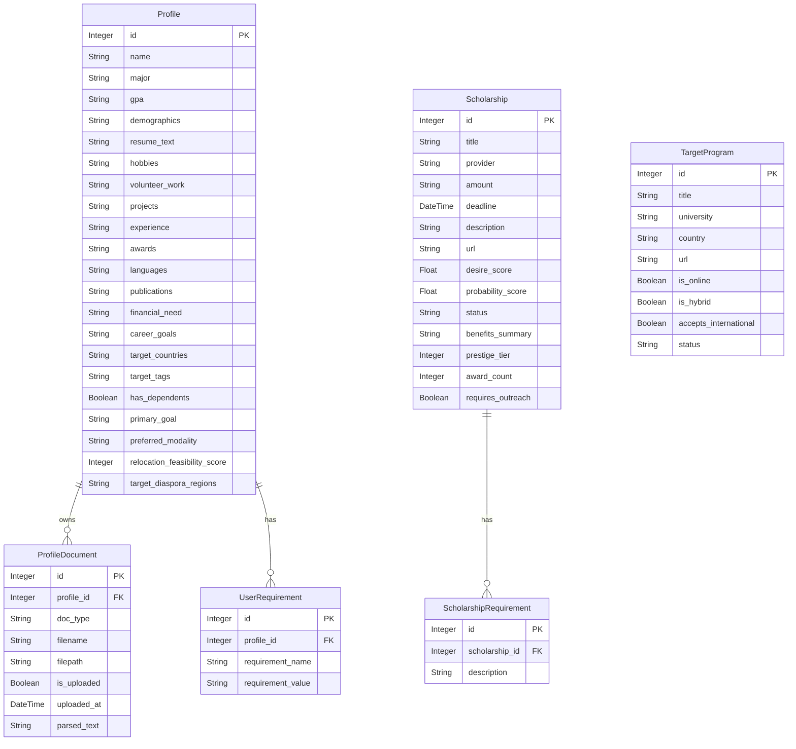

# Database Schema & Entity Relationship Diagram

This document outlines the SQLite schema (managed via SQLAlchemy) for the Educational Pathfinder platform.

## Entity Relationship Diagram (ERD)

## Data Dictionary

### `profiles`
The core user record. Stores parsed resume data and target preferences.
- **`primary_goal`**: String representing the user's objective (e.g., 'Emigrate', 'Brain-Circulation', 'Local Growth', 'Entrepreneurship').
- **`preferred_modality`**: 'Online', 'Hybrid', 'In-Person (Local)', 'In-Person (Abroad)'.
- **`relocation_feasibility_score`**: Integer (0-100) generated by Gemini acting as an immigration/career advisor based on CV strength.

### `profile_documents`
Tracks file uploads (CV, Recommendation Letters, Diplomas) and caches the extracted text strings via `pypdf`.
- **`doc_type`**: Enum-like string indicating the type of file (e.g., 'cv', 'bachelor_diploma').
- **`parsed_text`**: Raw text extraction cached to reduce repeated local file reading.

### `scholarships`
Financial aid scraped and scored against the user profile.
- **`desire_score`**: Alignment with user's tags/career goals.
- **`probability_score`**: Likelihood of winning based on GPA, demographics, and background matching.
- **`status`**: Kanban tracking column ('Discovered', 'To Apply', 'Drafting', 'Applied', etc.).

### `target_programs`
Academic degrees scraped from university portals or APIs.
- **`is_online` / `is_hybrid`**: Boolean flags used to filter lanes in the Dashboard.
- **`accepts_international`**: Boolean flag useful for reality checks based on the `primary_goal`.
