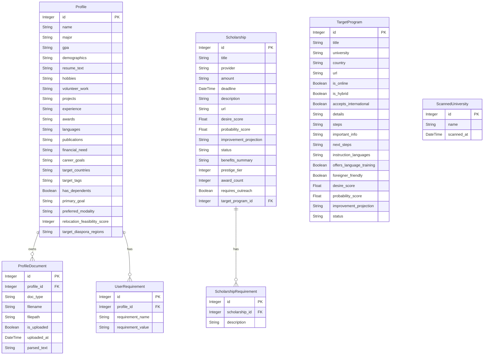

# Database Schema & Entity Relationship Diagram

This document outlines the SQLite schema (managed via SQLAlchemy) for the Educational Pathfinder platform.

## Entity Relationship Diagram (ERD)

## Data Dictionary

### 1. `profiles` Table
Stores primary user profile details, parsed resume contexts, and target matching preferences.

| Field | Type | Key | Nullable | Default | Description |
| :--- | :--- | :--- | :--- | :--- | :--- |
| `id` | `Integer` | `PK` | `No` | *None* | Primary Key. Unique auto-incrementing row ID. |
| `name` | `String` | | `No` | `"My Profile"` | Full name of the user. |
| `major` | `String` | | `Yes` | *None* | Major or primary field of academic study. |
| `gpa` | `String` | | `Yes` | *None* | Academic score or class rank (e.g. `"3.91"` or `"Top 5%"`). |
| `degree_level` | `String` | | `Yes` | *None* | Highest completed degree level. Normalized to: `"Bachelors"`, `"Masters"`, or `"PhD"`. |
| `nationalities` | `String` | | `Yes` | *None* | Comma-separated list of the user's citizenships (e.g. `"Peruvian, Spanish"`). |
| `demographics` | `String` | | `Yes` | *None* | Comma-separated list of demographics tags (e.g. `"First-Gen, Woman in STEM"`). |
| `extracurriculars` | `String` | | `Yes` | *None* | Text description listing student activities. |
| `resume_text` | `String` | | `Yes` | *None* | Cached plain text content parsed from the CV/Resume file. |
| `hobbies` | `String` | | `Yes` | *None* | Text description of personal hobbies and interests. |
| `volunteer_work` | `String` | | `Yes` | *None* | Text description of community service and volunteer history. |
| `projects` | `String` | | `Yes` | *None* | Summary descriptions of relevant software/academic projects. |
| `experience` | `String` | | `Yes` | *None* | Summary descriptions of past work or research roles. |
| `awards` | `String` | | `Yes` | *None* | Academic and professional awards or honor titles. |
| `languages` | `String` | | `Yes` | *None* | Languages spoken and related score certificates. |
| `publications` | `String` | | `Yes` | *None* | Academic publications, papers, or co-authored research works. |
| `financial_need` | `String` | | `Yes` | *None* | Explanatory text summarizing student financial need. |
| `career_goals` | `String` | | `Yes` | *None* | Long-term academic and professional aspirations. |
| `target_countries` | `String` | | `Yes` | *None* | JSON array string listing selected location targets (e.g. `[{"country": "Germany"}]`). |
| `undesired_countries` | `String` | | `Yes` | *None* | JSON array string of countries the user wants to explicitly avoid in search results. |
| `target_continents` | `String` | | `Yes` | *None* | JSON array string of preferred continent targets (e.g. `[{"continent": "Europe"}]`). |
| `undesired_continents` | `String` | | `Yes` | *None* | JSON array string of continents to exclude from discovery scans. |
| `target_areas` | `String` | | `Yes` | *None* | Desired fields of study or disciplines. |
| `target_tags` | `String` | | `Yes` | *None* | Comma-separated keywords matching study programs. |
| `experience_level` | `String` | | `Yes` | *None* | Overall professional background tier. |
| `target_universities` | `String` | | `Yes` | *None* | Specific universities targeted for matching. |
| `has_dependents` | `Boolean` | | `No` | `False` | Flag indicating if the user has family dependents. |
| `primary_goal` | `String` | | `Yes` | *None* | User objective: `"Local Growth"`, `"Entrepreneurship"`, `"Emigrate"`, or `"Brain-Circulation"`. |
| `preferred_modality` | `String` | | `Yes` | *None* | Preferences: `"Online"`, `"Hybrid"`, `"In-Person (Local)"`, or `"In-Person (Abroad)"`. |
| `relocation_feasibility_score` | `Integer` | | `Yes` | *None* | Calculated feasibility score (0-100) regarding migration requirements. |
| `target_diaspora_regions` | `String` | | `Yes` | *None* | Explanations regarding family connections or target regions abroad. |

---

### 2. `profile_documents` Table
Manages user uploaded documents and holds parsed raw text blocks.

| Field | Type | Key | Nullable | Default | Description |
| :--- | :--- | :--- | :--- | :--- | :--- |
| `id` | `Integer` | `PK` | `No` | *None* | Primary Key. Unique auto-incrementing document ID. |
| `profile_id` | `Integer` | `FK` (to `profiles.id`) | `No` | *None* | Foreign Key referencing the user profile owner. |
| `doc_type` | `String` | | `No` | *None* | Document class: `'cv'`, `'recommendation_letter_1'`, `'recommendation_letter_2'`, `'recommendation_letter_3'`, or `'bachelor_diploma'`. |
| `filename` | `String` | | `No` | *None* | Original uploaded file name. |
| `filepath` | `String` | | `No` | *None* | Server disk storage file path. |
| `is_uploaded` | `Boolean` | | `No` | `False` | Status flag validating upload success. |
| `uploaded_at` | `DateTime` | | `No` | `datetime.utcnow` | Timestamp recording when the document was received. |
| `parsed_text` | `String` | | `Yes` | *None* | Cached plain text block parsed out of the PDF or TXT file. |

---

### 3. `user_requirements` Table
Captures custom custom portfolio or application requirements mapped on profiles.

| Field | Type | Key | Nullable | Default | Description |
| :--- | :--- | :--- | :--- | :--- | :--- |
| `id` | `Integer` | `PK` | `No` | *None* | Primary Key. Auto-incrementing identifier. |
| `profile_id` | `Integer` | `FK` (to `profiles.id`) | `No` | *None* | Foreign Key mapping this requirement to a user profile. |
| `requirement_name` | `String` | | `No` | *None* | Name or title of the custom requirement (e.g. `"GitHub Portfolio"`). |
| `requirement_value` | `String` | | `No` | *None* | The contents or url reference details for this requirement. |

---

### 4. `scholarships` Table
Contains financial aid opportunities discovered and rated for matching.

| Field | Type | Key | Nullable | Default | Description |
| :--- | :--- | :--- | :--- | :--- | :--- |
| `id` | `Integer` | `PK` | `No` | *None* | Primary Key. Auto-incrementing row ID. |
| `title` | `String` | | `No` | *None* | Scholarship name. Indexed. |
| `provider` | `String` | | `No` | *None* | Host institution or agency funding the scholarship. |
| `amount` | `String` | | `Yes` | *None* | Financial worth representation (e.g. `"$15,000"`, `"Full Tuition"`). |
| `deadline` | `DateTime` | | `Yes` | *None* | Application closing deadline timestamp. |
| `description` | `String` | | `No` | *None* | Detailed text outline of rules, eligibility, and terms. |
| `url` | `String` | | `No` | *None* | Link target pointing to details or application form. |
| `desire_score` | `Float` | | `No` | `0.0` | Fit score rating (0-100) on user interest overlap. |
| `probability_score` | `Float` | | `No` | `0.0` | Win chance score (0-100) calculated on academic/trait matches. |
| `improvement_projection` | `String` | | `Yes` | *None* | Actionable advice on what hard requirements are missing to improve probability score. |
| `status` | `String` | | `No` | `"Discovered"` | Board column: `"Discovered"`, `"To Apply"`, `"Drafting"`, `"Applied"`, `"Rejected"`, `"Won"`, `"Discarded"`. |
| `benefits_summary` | `String` | | `Yes` | *None* | Extracted list of extra benefits (e.g. travel, housing, health). |
| `prestige_tier` | `Integer` | | `Yes` | *None* | Academic status tier index representing scholarship difficulty/reputation. |
| `award_count` | `Integer` | | `Yes` | *None* | Number of individual awards typically granted. |
| `requires_outreach` | `Boolean` | | `No` | `False` | Toggle flag set if contacting university advisors is recommended. |
| `target_program_id` | `Integer` | `FK` (to `target_programs.id`) | `Yes` | *None* | Optional link to the academic program this scholarship supports. Powers the nested funding UI. |

---

### 5. `scholarship_requirements` Table
Lists individual requirement constraints mapped to scholarships.

| Field | Type | Key | Nullable | Default | Description |
| :--- | :--- | :--- | :--- | :--- | :--- |
| `id` | `Integer` | `PK` | `No` | *None* | Primary Key. Auto-incrementing identifier. |
| `scholarship_id` | `Integer` | `FK` (to `scholarships.id`) | `No` | *None* | Foreign Key mapping to the parent scholarship. |
| `description` | `String` | | `No` | *None* | Statement detailing a specific scholarship requirement constraint. |

---

### 6. `target_programs` Table
Stores targeted university degree program matches found during discovery scans.

| Field | Type | Key | Nullable | Default | Description |
| :--- | :--- | :--- | :--- | :--- | :--- |
| `id` | `Integer` | `PK` | `No` | *None* | Primary Key. Auto-incrementing row ID. |
| `title` | `String` | | `No` | *None* | Program study major title. Indexed. |
| `university` | `String` | | `No` | *None* | Name of the higher-education institution hosting the program. |
| `country` | `String` | | `No` | *None* | Target country where the university resides. |
| `url` | `String` | | `Yes` | *None* | Program information web page. |
| `is_online` | `Boolean` | | `No` | `False` | Boolean set to true if the program is fully remote/online. |
| `is_hybrid` | `Boolean` | | `No` | `False` | Boolean set to true if the program is hybrid. |
| `accepts_international` | `Boolean` | | `No` | `True` | Boolean indicating if international applicants are welcome. |
| `details` | `VARCHAR` | | `Yes` | *None* | Detailed curriculum and program summary |
| `steps` | `VARCHAR` | | `Yes` | *None* | Step-by-step application instructions |
| `important_info` | `VARCHAR` | | `Yes` | *None* | Specific requirements, deadlines, and constraints |
| `next_steps` | `VARCHAR` | | `Yes` | *None* | Recommended immediate next actions |
| `instruction_languages` | `VARCHAR` | | `Yes` | *None* | Comma-separated string of languages the program is taught in (automatically serialized as a list of strings in the API response) |
| `offers_language_training` | `BOOLEAN` | | `No` | `0` | If the university provides language courses for foreigners |
| `foreigner_friendly` | `BOOLEAN` | | `No` | `1` | If the program explicitly caters to international students |
| `desire_score` | `FLOAT` | | `No` | `0.0` | Algorithmic compatibility match score |
| `probability_score` | `FLOAT` | | `No` | `0.0` | Algorithmic acceptance likelihood score |
| `improvement_projection` | `VARCHAR` | | `Yes` | *None* | Actionable feedback on missing hard requirements |
| `status` | `String` | | `No` | `"Discovered"` | Board column: `"Discovered"`, `"Preparing"`, `"Applied"`, `"Rejected"`, `"Accepted"`, `"Discarded"`. |

### 6. `scanned_universities` Table
Tracks all university domains that have already been explored by the Scout AI engine across scan executions.

| Field | Type | Key | Nullable | Default | Description |
| :--- | :--- | :--- | :--- | :--- | :--- |
| `id` | `Integer` | `PK` | `No` | *None* | Primary Key. Unique auto-incrementing row ID. |
| `name` | `String` | | `No` | *None* | Unique name/domain of the scanned university. |
| `scanned_at` | `DateTime` | | `No` | `utcnow` | Timestamp indicating when the university homepage was explored. |

### 7. `blacklisted_universities` Table
Tracks all universities explicitly blocked by the user to skip them entirely in future crawler executions.

| Field | Type | Key | Nullable | Default | Description |
| :--- | :--- | :--- | :--- | :--- | :--- |
| `id` | `Integer` | `PK` | `No` | *None* | Primary Key. Unique auto-incrementing row ID. |
| `name` | `String` | | `No` | *None* | Unique name of the blacklisted university. |
| `blacklisted_at` | `DateTime` | | `No` | `utcnow` | Timestamp indicating when the university was blacklisted. |

---

## Auxiliary Databases & Datasets

To support the asynchronous mass-scanning engine, the backend utilizes separate secondary data storage mechanisms. This isolates heavy queue polling and massive static lookups from the primary SQLite application database.

### 1. `huey_tasks.db` (SQLite)
A dedicated SQLite database initialized by `backend/worker.py` to handle the `SqliteHuey` background queue.
- **Purpose:** Tracks background task definitions, enqueued `run_mass_discovery_job` tasks, schedules, and worker execution locks.
- **Why Separate:** Prevents database locking (`OperationalError: database is locked`) when the FastAPI application performs read/write operations on `Profile` or `Scholarship` tables simultaneously while the worker rapidly polls for jobs.

### 2. `universities.json` (Flat File JSON)
A localized, heavily optimized JSON document generated by `backend/fetch_ror.py` containing a mapping of verified global academic institutions.
- **Source:** The **Research Organization Registry (ROR)** open-source Zenodo data dump.
- **Fields:** Array of objects containing:
  - `name`: Official institution name.
  - `country`: Alpha code or full string country representation.
  - `domains`: Array of official website URLs (e.g., `["harvard.edu"]`).
- **Purpose:** Replaces the deprecated Hipolabs API. Enables instantaneous, offline, and rate-limit-free university URL seeding for the crawler.
