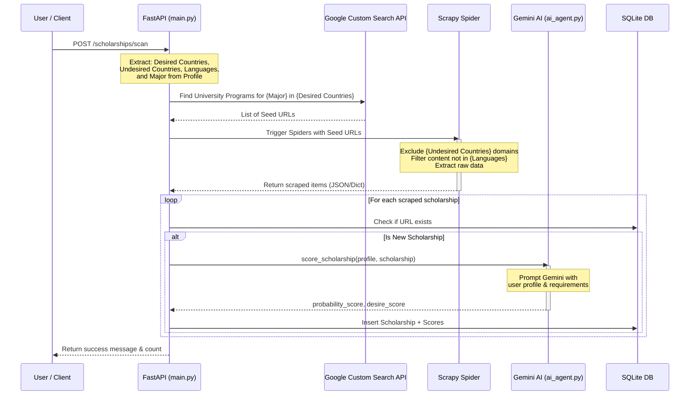
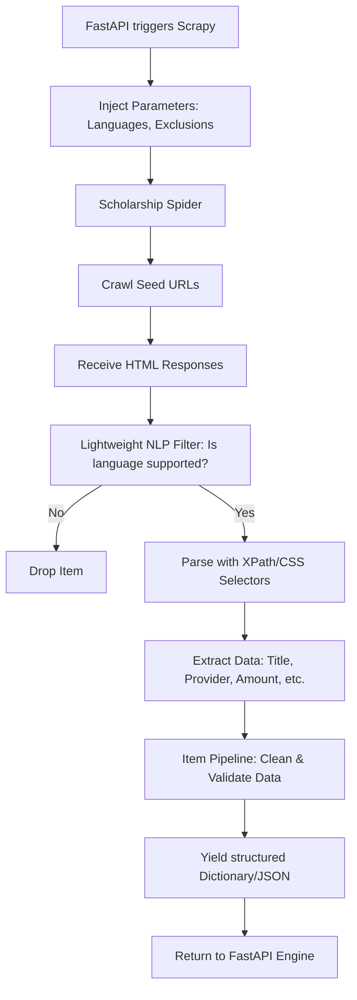

# Discovery Engine Technical Breakdown

The Discovery Engine in the Scholarship Hunter project is responsible for finding new scholarships and determining their relevance and likelihood of success for the current user. 

## High-Level Workflow
The process is initiated via the `/scholarships/scan` POST endpoint in `backend/main.py`. The workflow integrates worldwide targeted web scraping, de-duplication, AI-driven scoring, and data persistence.

## Deep Dive: The Worldwide Discovery Process
To avoid being limited to standard scholarship portals, we utilize a **Two-Phase Discovery Process** to search for university programs and financial aid worldwide.

### Phase 1: Search Seeding
Instead of running blindly, the backend compiles actionable parameters from the user's Profile:
- **Desired Locations (Pros):** Extracted from the Interactive Map to focus the search (e.g. `site:.edu`, `site:.ca`).
- **Undesired Locations (Cons):** Extracted from the map to construct absolute exclusion filters (`-site:.ru`, `-site:.cn`) to ensure no time is wasted on restricted regions.
- **Languages:** Limits the search to programs taught in languages the user actually speaks.
- **Major/Keywords:** Used as the primary search query.

These parameters are sent to a Search API (like Google Custom Search) to generate a high-quality list of seed URLs pointing directly to university program and financial aid pages.

### Phase 2: Dynamic Scrapy Crawling
The generated seed URLs are passed to Scrapy (`CrawlerProcess`).

## Payload and AI Scoring
The AI Agent no longer just scores "scholarships"; it evaluates whether a given university program matches the candidate and if financial aid is plausible.

The payload sent to the `gemini-3.5-flash` model contains:
- `major`: Field of study
- `gpa`: Grade Point Average
- `demographics`: Background characteristics
- `experience`: Work history
- `languages`: Language proficiency
- `financial_need`: Socioeconomic background constraints
- `career_goals`: Aspirations
- `preferred_modality`: Online vs In-Person

**Token consumption** occurs only *after* the Scrapy pipeline has filtered out undesired countries and unsupported languages, saving significant AI resources.
