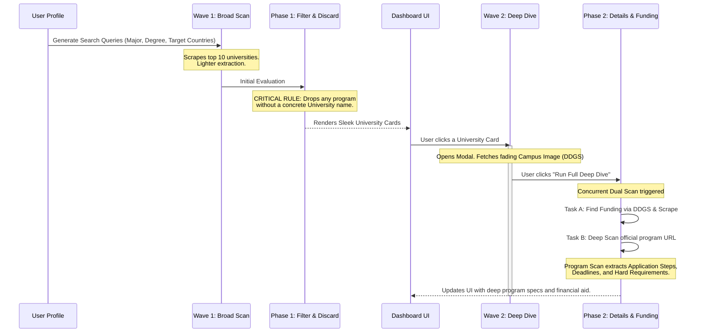

# Discovery Engine Technical Breakdown

The Discovery Engine is the core of the Scholarship Hunter platform. It utilizes a **Standardized Pipeline** to find university programs and financial aid worldwide, parse unstructured university web pages, and match them against a user's rich profile.

## The Two-Wave Discovery Architecture

To provide a premium, credible experience while conserving compute, we split the engine into two phases: **Wave 1 (Broad Discovery)** and **Wave 2 (Deep Dive)**.

### Phase 1: Search Seeding vs. Full Profile Evaluation
**Why don't we put the whole profile into the search engine?**
If we put a user's entire profile (experience, volunteering, exact GPA, languages) into a Google/DuckDuckGo search bar, it will return zero results because the query is too hyper-specific. 
Instead:
1. **Search Seeder (DuckDuckGo):** Uses only the *broad constraints* (Major, Degree Level, Target Countries, and generic program/scholarship keywords) to cast a wide net and find relevant university portal pages.
2. **AI Extractor & Scorer:** Once we download the webpage text, the AI uses the *entire, rich profile* (including professional development, volunteering, and experience) to evaluate if the user is a strong candidate for that specific program or scholarship.

### Phase 2: Crawling & Cloudflare Bypass
To prevent getting blocked by modern university portals and burning massive amounts of AI tokens:
- **Stealth Browsing:** We utilize the `Scrapling` library to natively bypass Cloudflare's "Turnstile" or interstitial challenges, ensuring we don't just extract 403 Forbidden pages.
- **Local Pre-filtering:** Before hitting the AI, the scraper extracts only paragraphs containing targeted keywords (e.g., "$", "tuition", "deadline", "apply", "program", "degree"). If the page lacks these, it may be discarded early or heavily truncated to save tokens.

### Phase 3: Dual-Extraction via Hugging Face
Because extraction is a token-heavy process running over dozens of pages, we offload this task from Gemini to a free, fast open-source model via Hugging Face (e.g., `Qwen2.5`).
The AI enforces a strict JSON output representing two parallel lists: `TargetPrograms` (with curriculum details, steps, and deadlines) and `Scholarships` (with amounts and benefits). 

#### Strict Scoring Algorithm
During extraction, the LLM uses highly engineered strict logic to calculate scores and discard irrelevant items:
- **Major Alignment Rejection**: The AI immediately sets `is_valid=False` if the program completely misses the user's major (e.g., rejecting a "Chemistry" program for a "Systems Engineering" profile).
- **Desire Score (Compatibility)**: Calculated as **40%** Academic Field Match + **30%** Location/Modality Match + **30%** Career Goals Match.
- **Probability Score (Acceptance Likelihood)**: Operates with a **Hard Ceiling**. If the user is missing a mandatory document or standardized test (IELTS/GRE) or has a low GPA, their probability is capped at **30%**, regardless of soft factors like work experience.
- **Actionable Advice (Improvement Projection)**: If a user is capped by the ceiling, the LLM populates the `improvement_projection` field with specific steps to bypass it (e.g., *"Upload an IELTS score of 7.0 to bypass the ceiling and boost probability to 90%+"*).

### Phase 4: UI Presentation (University-Centric) & Targeted Funding
To accurately reflect the real-world admissions journey, the UI is heavily **University-Centric**:
1. **University Clusters**: Target Programs are not listed randomly. They are grouped under their host institution (e.g., *Technical University of Munich*).
2. **Targeted Funding Scans**: Financial aid is inherently tied to specific institutions and programs. The global scan discovers programs; then, users trigger a highly specific `POST /api/programs/{id}/find-funding` pipeline. 
   - This explicitly injects the `University` and `Program Title` into the DuckDuckGo seeder and the LLM context.
   - The LLM runs a secondary extraction pass that completely ignores new programs and solely pulls down scholarships and financial aid tied to that specific university.
3. **Nested Secured Funding**: Once discovered, targeted scholarships render visually nested under the specific academic program they support, enforcing the dependency that admissions come first, funding follows.

**Machine Learning Feedback Loop & Soft Deletes**:
Users can click a "Not Interested" (Discard) button on any program card or scholarship. This triggers a `PATCH` request that updates the database item to `status = "Discarded"`. The item is hidden from the UI but preserved in the database (Soft Delete) to train future search-accuracy models on the user's rejection patterns.
