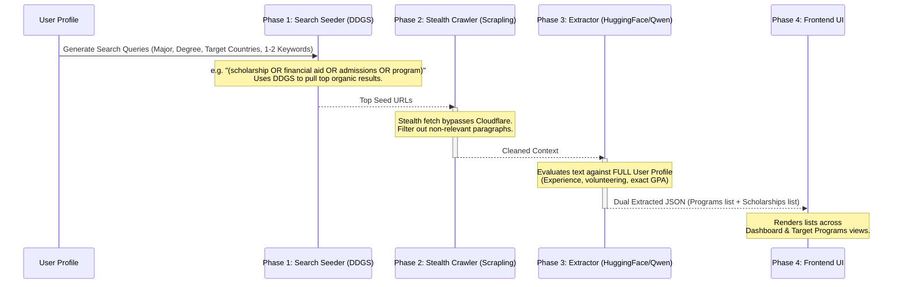

# Discovery Engine Technical Breakdown

The Discovery Engine is the core of the Scholarship Hunter platform. It utilizes a **Standardized Pipeline** to find university programs and financial aid worldwide, parse unstructured university web pages, and match them against a user's rich profile.

## The Standardized Pipeline

We cannot build custom scrapers for every university on earth. Instead, we use a generic funnel that treats every university program as an object with a strict schema. 

### Phase 1: Search Seeding vs. Full Profile Evaluation
**Why don't we put the whole profile into the search engine?**
If we put a user's entire profile (experience, volunteering, exact GPA, languages) into a Google/DuckDuckGo search bar, it will return zero results because the query is too hyper-specific. 
Instead:
1. **Search Seeder (DuckDuckGo):** Uses only the *broad constraints* (Major, Degree Level, Target Countries, and generic program/scholarship keywords) to cast a wide net and find relevant university portal pages.
2. **AI Extractor & Scorer:** Once we download the webpage text, the AI uses the *entire, rich profile* (including professional development, volunteering, and experience) to evaluate if the user is a strong candidate for that specific program or scholarship.

### Phase 2: Crawling & Cloudflare Bypass
To prevent getting blocked by modern university portals and burning massive amounts of AI tokens:
- **Stealth Browsing:** We utilize the `Scrapling` library to natively bypass Cloudflare's "Turnstile" or interstitial challenges, ensuring we don't just extract 403 Forbidden pages.
- **Local Pre-filtering:** Before hitting the AI, the scraper extracts only paragraphs containing targeted keywords (e.g., "$", "tuition", "deadline", "apply", "program", "degree"). If the page lacks these, it may be discarded early or heavily truncated to save tokens.

### Phase 3: Dual-Extraction via Hugging Face
Because extraction is a token-heavy process running over dozens of pages, we offload this task from Gemini to a free, fast open-source model via Hugging Face (e.g., `Qwen2.5`).
The AI enforces a strict JSON output representing two parallel lists: `TargetPrograms` (with curriculum details, steps, and deadlines) and `Scholarships` (with amounts and benefits). The LLM calculates 'desire' and 'probability' scores for both entities simultaneously.

### Phase 4: UI Presentation & Feedback Loop
Financial Aid and Scholarships are displayed in the Dashboard, while Target Programs are surfaced with their application steps.

> **TODO: Machine Learning Feedback Loop**
> Add functionality for the user to mark a discovered program as "Not Interested". We must log this rejection and eventually learn patterns (e.g., "User consistently rejects programs with tuition > 10k") to refine the Search Seeder logic in future scans.
