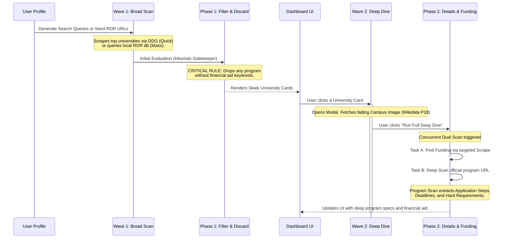

# Discovery Engine Technical Breakdown

The Discovery Engine is the core of the Scholarship Hunter platform. It utilizes a **Standardized Pipeline** to find university programs and financial aid worldwide, parse unstructured university web pages, and match them against a user's rich profile.

## The Two-Wave Discovery Architecture

To provide a premium, credible experience while conserving compute, we split the engine into two phases: **Wave 1 (Broad Discovery)** and **Wave 2 (Deep Dive)**. We also provide two modes of execution for Wave 1: **Quick Scan** and **Deep Mass Scan**.

### Phase 1: Quick Scan vs. Deep Mass Scan

**1. Quick Scan (Synchronous)**
The Quick Scan uses `ddgs` (DuckDuckGo) to search for broad keywords based on the user's major and target countries. It seeds the scraper with ~10 results and streams the extraction progress via Server-Sent Events (SSE) directly to the UI.

**2. Deep Mass Scan (Asynchronous Background Task)**
For a comprehensive search, the user triggers the Deep Mass Scan.
- **Task Queue System**: We utilize **Huey** backed by **SQLite** (`SqliteHuey`). This offloads the heavy AI scraping from FastAPI's request cycle to a background `worker.py` process.
- **University Domain Database (ROR)**: Instead of DDG, we rely on the **Research Organization Registry (ROR)**. A script (`fetch_ror.py`) queries the Zenodo API for the latest ROR open-source data dump, filtering it down to ~24,000 educational domains (`universities.json`). 
- **AI Scout Navigation**: The background worker fetches the homepage of each matching domain, extracts all internal links via BeautifulSoup, and feeds them to an AI "Scout". The Scout evaluates the links against the user's profile and returns the top 2-3 specific URLs most likely to contain academic programs or admissions info, completely eliminating the need to blindly guess URL paths.
- **Frontend Interfacing**: The frontend receives a `job_id` and runs an active polling loop against `GET /scholarships/mass-scan/{job_id}/status`, reading static JSON log files without stressing the backend.

### Phase 2: Tier 1 Heuristic Gatekeeper & Crawling

## Tier 1: AI Scout Guided Crawling & Heuristic Gatekeeper
Before performing a deep extraction, the worker relies on a highly efficient pipeline:
1. **AI Scout Selection**: The AI Scout has already pre-selected the 2-3 most relevant links from the university's homepage structure.
2. **Multilingual Gatekeeper**: It fetches those specific pages and applies a relaxed keyword density heuristic. It translates academic keywords (program, degree, bachelor, major) into the target country's native language.
3. If the density of these translated keywords is below `0.2 per 1000 words` (meaning roughly 0 hits), the page is dropped. This serves as a safety net to ensure the Scout didn't hallucinate an empty page.
This ensures only highly relevant, organically discovered academic pages reach the Deep Extraction LLM.

### Tier 2: Deep Extraction via Local AI (Llama 3.1)
Pages that pass Tier 1 are fed to the local `llama3.1` (8B) model running natively on the Host OS via Ollama (configured in `main.py` and `ai_agent.py` through LangChain).

**Data Standardization (Pre-LLM)**
To maximize accuracy, we feed the LLM highly curated seed data:
- **Categorized Major Standardization**: The UI explicitly groups 40+ recognized global academic majors (e.g. Engineering, Business). By forcing the user to pick from this structured `CATEGORIZED_MAJORS` dictionary (in `Profile.tsx`), the LLM avoids misinterpreting niche or non-translatable degree titles, granting it a universally understood anchor point.

During extraction:
- The LLM extracts structured data adhering to `schemas.py`.
- **Language Feasibility**: It checks if the `instruction_languages` match the user's known languages. If not, and no `offers_language_training` is available, it caps the `probability_score` to 15%.

#### Strict Scoring Algorithm
During extraction, the LLM uses highly engineered strict logic to calculate scores and discard irrelevant items:
- **Target Disciplines Pivot**: The platform explicitly separates the user's *Past Background* (e.g. Computer Science) from their *Target Disciplines* (e.g. Tech MBA). The AI uses the Target Disciplines field to find interdisciplinary pivots instead of strictly searching for their previous major.
- **Desire Score (Compatibility)**: Calculated as **40%** Target Disciplines Match + **30%** Location/Modality Match + **30%** Career Goals Match.
- **Probability Score (Acceptance Likelihood)**: Operates with a **Hard Ceiling**. If the user is missing a mandatory document or standardized test (IELTS/GRE) or has a low GPA, their probability is capped at **30%**.
- **Actionable Advice (Improvement Projection)**: If a user is capped by the ceiling, the LLM populates the `improvement_projection` field with specific steps to bypass it (e.g., *"Upload an IELTS score of 7.0 to bypass the ceiling"*).

### Phase 4: UI Presentation (University-Centric) & Targeted Funding

To accurately reflect the real-world admissions journey, the UI is heavily **University-Centric**:
1. **University Clusters**: Target Programs are grouped under their host institution.
2. **Targeted Funding Scans**: Financial aid is inherently tied to specific institutions and programs. The global scan discovers programs; then, users trigger a highly specific `POST /api/programs/{id}/find-funding` pipeline.
3. **Nested Secured Funding**: Targeted scholarships render visually nested under the specific academic program they support.

**Machine Learning Feedback Loop & Soft Deletes**:
Users can click a "Not Interested" (Discard) button on any program card. This triggers a `PATCH` request updating the database item to `status = "Discarded"`. The item is preserved in the database (Soft Delete) to eventually train future search-accuracy ML models on the user's rejection patterns.

---

## CV Profile Autofill Pipeline

Educational Pathfinder includes an AI-assisted onboarding flow where users upload their CV/Resume to automatically populate their matching profiles. To ensure pristine, hallucination-free data extraction, the agent relies on a multi-pass focused pipeline:

### 1. Spacing Normalization (Pre-LLM)
* **Problem**: PDF parser text extractions often yield text with single spaces between every letter (e.g. `C o o r d i n a t e d`). This tokenizes extremely poorly in local models, causing massive hallucinations.
* **Solution**: `clean_pdf_spaces` dynamically merges characters back into proper words before feeding the raw text to the model.

### 2. High-Precision 3-Pass Focused Pipeline
Instead of running a single extraction pass (which overwhelms smaller local models like Llama 3.1 8B), the parser runs three sequential focused passes:
1. **Pass 1: Core Profile**: Extracts name, major, degree level, nationalities, languages, and goals.
2. **Pass 2: Work Experience**: Focused pass under strict rules to extract paid jobs and internships only, enforcing exact CV dates. It explicitly forbids academic degrees, certifications, or volunteer roles from appearing as experience.
3. **Pass 3: Highlights & Projects**: Focused pass to extract projects, awards, publications, volunteer activities, and hobbies.

### 3. Frontend Dropdown Mapping & Typo Tolerance
To ensure extracted values match the strict select options on the frontend, Python helper functions (`normalize_major` and `normalize_degree_level`) dynamically clean and map text variations (e.g., mapping `"Information and Systems Engineering"` to `"Systems Engineering"`, and `"Bachellor"` to `"Bachelors"`).

### 4. Recursive Plain-Text Bullet Formatting
To prevent raw JSON brackets, curly braces, and quotes from displaying inside the textareas, `format_list_to_plain_text` recursively formats nested lists or dictionary elements (e.g. nested lists of project bullet points) into clean, human-readable indented bullet points.

### 5. Mock Data Leakage Prevention
To prevent pre-seeded mock user details from persisting, `parse_profile_from_document` returns a complete model dump of all CV-derived fields. The endpoint `/profile/parse-doc/{doc_type}` explicitly clears and overwrites fields in the database with empty string defaults (or `"[]"` / `None` depending on type) if the uploaded CV does not contain them.
