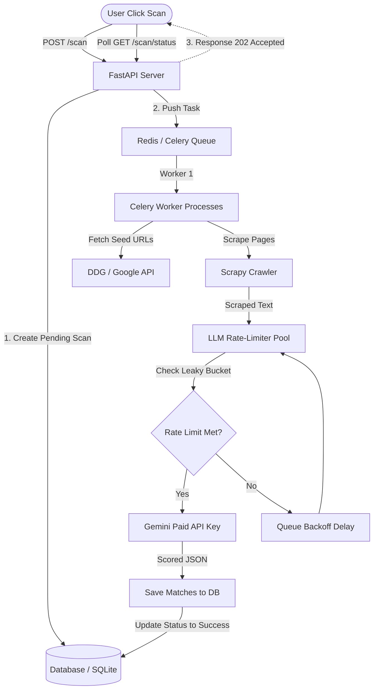

# Gemini API Scaling Strategy & Constraints

This document outlines the operational constraints discovered during development of the **Educational Pathfinder** Discovery Engine, analyzes the impact of using free-tier Gemini API keys, and defines the architectural roadmap to safely scale the application to production.

---

## 1. Executive Summary
During end-to-end testing of the Discovery Scan engine (which queries, scrapes, parses, and scores scholarship opportunities using `gemini-3.5-flash`), we identified two critical bottlenecks:
1. **API Rate-Limiting**: The Gemini Free Tier has extremely low rate limits (15 Requests Per Minute). A single discovery scan crawling multiple pages easily exceeds this threshold, causing HTTP 429 (`RESOURCE_EXHAUSTED`) errors.
2. **Synchronous Execution & Hangs**: The FastAPI endpoint blocks until the Scrapy crawler and LLM evaluation processes are complete. Because the LangChain client automatically retries on 429/503 errors using exponential backoff, a rate-limited scan can block the HTTP request thread for several minutes.

---

## 2. Current Constraints (Free Tier & Dev State)

### 2.1. Gemini Free Tier Quota Limits
The Gemini API free tier enforces the following default quotas on `gemini-3.5-flash`:
*   **Requests Per Minute (RPM)**: 15 RPM
*   **Requests Per Day (RPD)**: 1,500 RPD
*   **Tokens Per Minute (TPM)**: 1,000,000 TPM

### 2.2. The Scanning Operation Loop
When a user runs a scan:
1. **Search**: DuckDuckGo returns ~5 seed URLs.
2. **Crawl**: Scraper crawls the seed URLs and optionally traverses child links.
3. **Parse & Score**: The LLM is invoked in a loop to extract and score **each individual page** that matches pre-filter keywords.

If the crawler scrapes 8 pages, the system attempts to make **8 concurrent or back-to-back LLM calls**. Under the free tier's 15 RPM constraint, this consumes over 50% of the minute's quota instantly. If two users scan concurrently, the system immediately hits the 429 quota ceiling.

### 2.3. Retry Exhaustion & Blocked Threads
LangChain's model client uses the `tenacity` library to handle network anomalies. On receiving a `429 Resource Exhausted` code, it waits for the API-returned retry delay (up to 60 seconds) and retries.
*   **Symptoms**: The page loading spinner spins indefinitely, and the console reports uvicorn/HTTP request lag.
*   **Cause**: The Python handler is blocked in a synchronous `p.join()` call waiting for the crawler/LLM pipeline to finish.

---

## 3. Mitigations Implemented

To keep the development environment stable, we implemented configuration safeguards in the backend:

1.  **Crawl Ceiling (`SCRAPER_MAX_PAGES`)**: Added to [.env](file:///c:/Users/migue/.gemini/antigravity/scratch/Scholarship-hunter/backend/.env) (default: `8`). This instructs the Scrapy crawler to close immediately after hitting the page limit, preventing runaway traversal loops.
2.  **Depth Restriction (`SCRAPER_DEPTH_LIMIT`)**: Configured to `1` (or `0`). Allows users to restrict the crawler to only index the main seed pages directly returned by search engines, keeping LLM calls minimal.
3.  **Token Truncation (`SCRAPER_MAX_TEXT_LENGTH`)**: Restricts scraped page text to the first `5000` characters, keeping prompt token size low and preventing Token Per Minute (TPM) exhaustions.

4.  **Open-Source Offloading (Implemented)**: We successfully replaced the `gemini-3.5-flash` model with `Qwen2.5-7B-Instruct` via the free Hugging Face API for the heavy Discovery extraction phase. Gemini is now strictly reserved for lightweight, asynchronous tasks like drafting essays and emails, effectively eliminating the risk of burning through the Gemini free tier quotas during scans.

---

## 4. Production Architecture & Scaling Roadmap

Moving the Pathfinder Discovery Engine to a commercial, multi-user production environment requires transitioning from a synchronous hobby setup to a decoupled, distributed queue architecture.

### 4.1. Transition to Gemini Pay-As-You-Go Tier
The first requirement is upgrading the Google AI Studio project to a paid billing plan. The paid tier for **Gemini 1.5/2.0 Flash** dramatically increases throughput:
*   **RPM**: 2,000 RPM (a **133x increase** over free tier).
*   **RPD**: 4,000,000 RPD.
*   **Cost**: Input: $0.075 / 1M tokens | Output: $0.30 / 1M tokens (roughly $0.03 per 100 scans, making it extremely cost-efficient).

### 4.2. Decouple via Asynchronous Task Queues (Celery & Redis)
A web request should **never** block on web scraping or batch LLM execution. 
*   **Action**: Implement **Celery** with a **Redis** broker.
*   **Flow**:
    1.  The user clicks "Run Discovery Scan".
    2.  FastAPI registers a `scan_job` in the database with status `Pending` and submits the task to Redis.
    3.  FastAPI immediately returns `202 Accepted` to the frontend with a `job_id`.
    4.  The frontend polls `/scan/status/{job_id}` (or listens via WebSockets) to display progress.
    5.  A background Celery worker picks up the job, crawls the pages, makes the LLM calls, saves results to the database, and marks the job as `Completed`.

### 4.3. Implement a Rate-Limiting Broker (Leaky Bucket)
To protect API keys from sudden bursts of concurrent scans, the Celery workers must route LLM calls through a rate-limiting broker.
*   **Action**: Use Redis to implement a **Token Bucket** or **Leaky Bucket** rate-limiting middleware.
*   **Mechanism**: If the worker pool is about to exceed the configured RPM limit (e.g., 1000 RPM to leave safety margins), tasks are automatically delayed in the queue rather than hitting the Gemini endpoints and triggering HTTP 429s.

### 4.4. Cache Scraped Content & Results
Many scholarship pages do not change frequently. Re-evaluating the same page for the same profile multiple times wastes tokens.
*   **Action**: Cache page contents in a database table keyed by `sha256(url)`. 
*   **Mechanism**: If a URL has been crawled in the last 7 days, retrieve the text from the cache instead of loading the page. If the user's profile hasn't changed, reuse the previously calculated `desire_score` and `probability_score` instead of calling Gemini.

### 4.5. Multi-Key Rotation & Secondary Model Fallbacks
In production, high availability is critical.
*   **Action**: Implement an API key rotation pool. If one key is rate-limited or exhausted, the system automatically cycles to a secondary key.
*   **Action**: Add model fallback logic. If `gemini-3.5-flash` fails or goes offline, fall back to `gemini-1.5-flash` or a secondary LLM provider.
