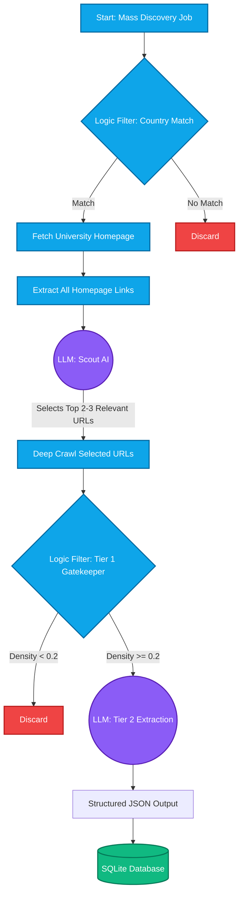
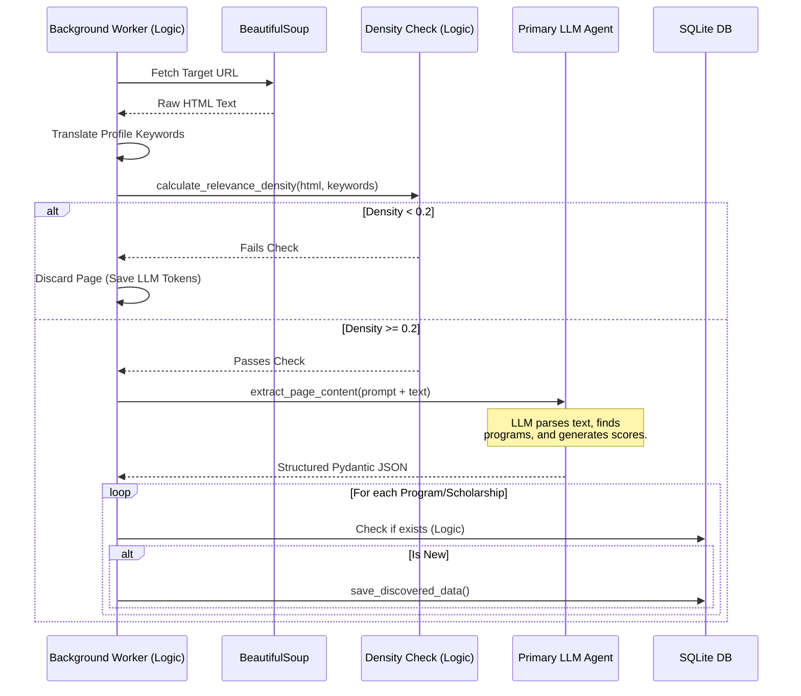

# Scholarship Hunter: Pipeline Architecture & Logic Routing

This document outlines the architecture of the **Mass Discovery Pipeline** in Scholarship Hunter. A core design philosophy of the system is a **"hybrid-filter" approach**: it uses cheap, fast programmatic logic to handle bulk processing and filtering, and only deploys expensive, intelligent LLM calls where nuanced reasoning is required.

---

## 1. High-Level Architecture Flow

The discovery job (`run_mass_discovery_job` in `worker.py`) follows a funnel model. It starts with a massive database of universities, aggressively filters them down using code, and then uses the LLM to extract the final structured data.

> **Legend**: Blue squares represent **Standard Code Logic**, Purple circles represent **LLM/AI Inference**.

---

## 2. Where is Pure Logic Applied?

Standard programmatic logic (Python) is used as the "muscle" of the pipeline to do heavy lifting, routing, and cost-saving gatekeeping.

### A. Country Filtering & Mapping
Before fetching any websites, the system parses the user's profile JSON. It uses the `pycountry` library to map preferred country names to ISO codes. It then compares this against the `universities.json` database. If a university is not in the user's target countries, it is instantly skipped.

### B. Link Extraction & Deduplication
Standard web scraping (`BeautifulSoup` and `requests`) is used to fetch the university homepage and parse out every single `<a href="...">` tag, resolving relative URLs into absolute ones and deduplicating them.

### C. Multilingual Keyword Translation
The pipeline dynamically builds a set of target languages based on the user's preferred countries (e.g., France -> French). It uses the `deep-translator` library to translate the user's core keywords (e.g., "scholarship", "computer science") into those target languages.

### D. The "Tier 1 Gatekeeper"
This is the most critical logic-based cost saver. The function `calculate_relevance_density()` calculates keyword density:
1. It counts how many times the translated keywords appear on the scraped webpage.
2. It calculates a ratio (matches per 1000 words).
3. If the density is below a strict threshold (`< 0.2`), the page is **instantly discarded**. This prevents the system from sending useless pages (like campus maps or cafeteria menus) to the LLM, saving thousands of tokens.

---

## 3. Where is LLM Intelligence Applied?

LLMs (via Langchain, Ollama, or HuggingFace) are deployed specifically as the "brains" for tasks that require semantic understanding, unstructured data extraction, and subjective scoring.

### A. Scout AI (Link Routing)
*   **Function:** `evaluate_navigation_links()`
*   **Why LLM?** A homepage might have 300 links. Simple logic can't easily tell if "/admissions/grad" or "/departments/engineering" is more relevant to a specific user.
*   **How it works:** The LLM is given the user's profile and the massive list of raw links, and is prompted to act as a "Scout" to identify the top 2-3 most promising URLs for that specific student.

### B. Tier 2 Deep Extraction
*   **Function:** `extract_page_content()`
*   **Why LLM?** University program pages are highly unstructured and vary wildly between institutions. 
*   **How it works:** Pages that pass the Tier 1 logic gate are sent to the LLM. The LLM reads the raw text and is forced to map it to a strict `ExtractedPageData` Pydantic schema (JSON). It extracts programs, scholarships, deadlines, and determines if the program is online, hybrid, etc.

### C. Subjective Scoring & Projections
During the Tier 2 extraction, the LLM is instructed via the prompt to act as an admissions advisor. It calculates two fields dynamically:
1.  **`desire_score`**: How well the program matches the user's career goals and target disciplines.
2.  **`probability_score`**: How likely the user is to get in.
3.  **`improvement_projection`**: Actionable advice. If the LLM notices the user is missing a hard requirement (like an IELTS score), it limits their probability score to 30% and writes a note advising them to take the test.

---

## 4. Sequence Diagram of a Single Page Scan

Here is a deeper look at the interplay between the two systems once a target URL is selected:

## Summary

In short: **Logic does the filtering, routing, and math. LLMs do the reading, comprehension, and subjective assessment.** This hybrid architecture ensures the pipeline is both economically scalable and intelligently accurate.
